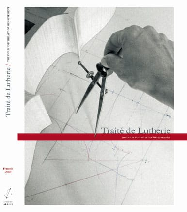

Traité de Lutherie
==================

Les petites raisons des arts et du violon en particulier
--------------------------------------------------------

*   [Traité de Lutherie](index.html)
*   [Présentation](page1/page1.html)
*   [L'auteur](page2/page2.html)
*   [Le sommaire](page14/page14.html)
*   [Apprendre à tracer](page3/page3.html)
*   [le tracé d'un alto](page21/page21.html)
*   [Video](page20/page20.html)
*   [Commander](page5/page5.html)
*   [Agenda](page6/page6.html)
*   [Contacts](page7/page7.html)
*   [Erratum](page19/page19.html)
*   [Autres thèmes…](page4/page4.html)

Découvrez les secrets d'une forme.....  
  
  
